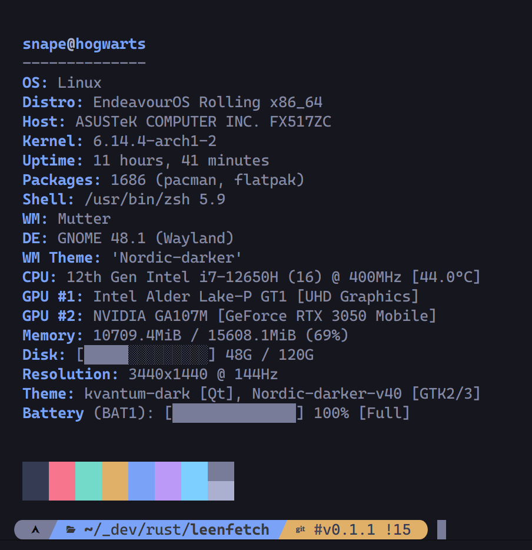
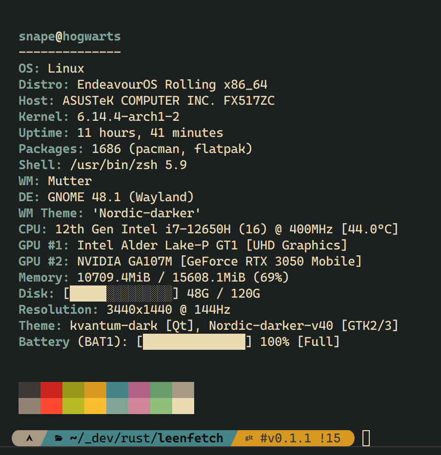
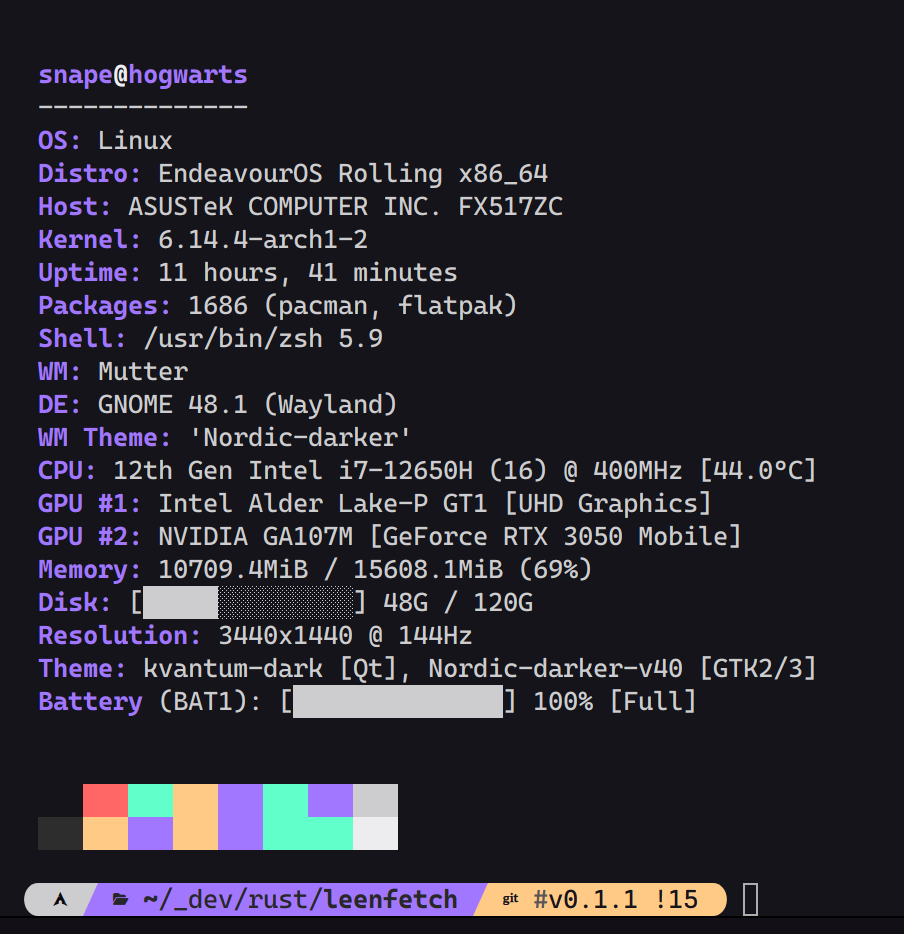
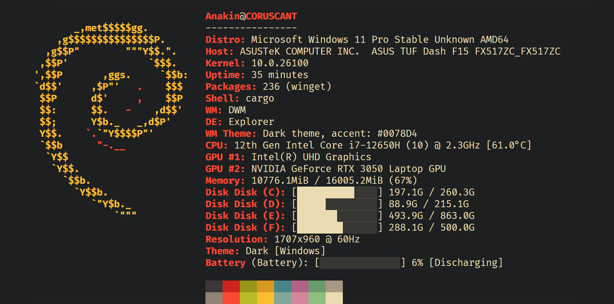
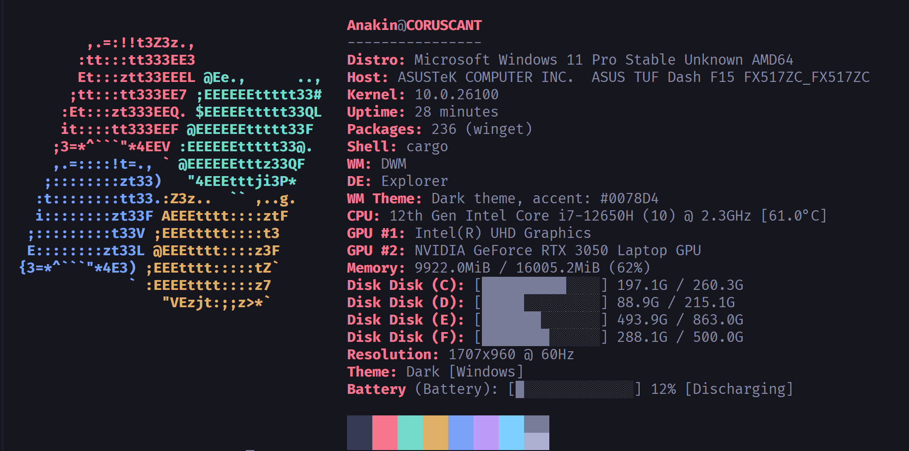
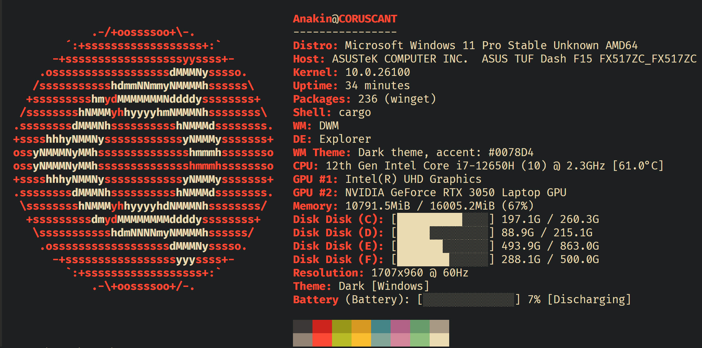
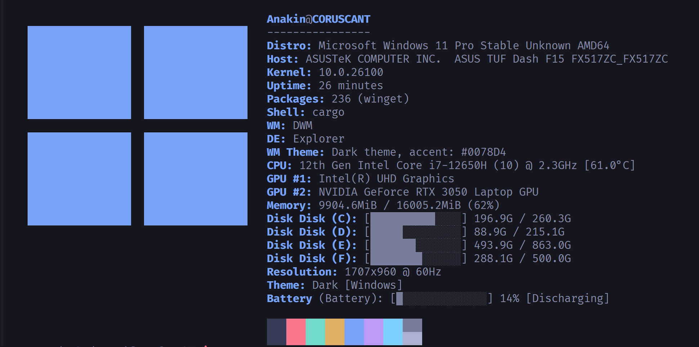
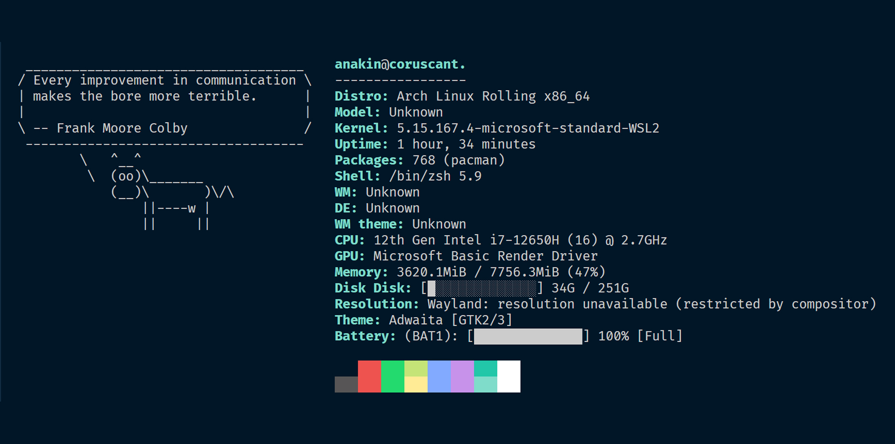
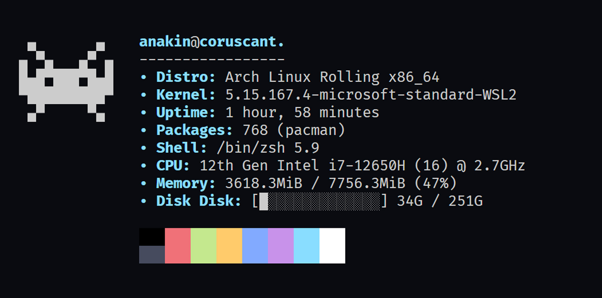

# 🧠 LeenFetch

[](https://crates.io/crates/leenfetch)
[](LICENSE)
[](https://github.com/drunkleen/leenfetch/actions/workflows/release.yml)


<!-- > 🌐 Available in: [English](#) | [فارسی](./readme/README-fa.md) | [Русский](./readme/README-ru.md) | [中文](./readme/README-zh.md)
**** -->


##### A fast, minimal, and customizable system information tool built in Rust — your alternative to Neofetch, for real power users.


> ⚠️ **LeenFetch is under active development. Expect bugs and improvements regularly!**
>
> Want to help? Contributions, testing, and feedback are always welcome!


## 💬 Feedback & Issues

Found a bug? Got a feature idea?  
Head over to the [issues](https://github.com/drunkleen/leenfetch/issues) or join the [discussions](https://github.com/drunkleen/leenfetch/discussions) page!


## 📚 Table of Contents

- [🧠 LeenFetch](#-leenfetch)
        - [A fast, minimal, and customizable system information tool built in Rust — your alternative to Neofetch, for real power users.](#a-fast-minimal-and-customizable-system-information-tool-built-in-rust--your-alternative-to-neofetch-for-real-power-users)
  - [💬 Feedback \& Issues](#-feedback--issues)
  - [📚 Table of Contents](#-table-of-contents)
  - [📸 Screenshots](#-screenshots)
  - [🚀 Features](#-features)
  - [▨ Packaging Status](#-packaging-status)
  - [📦 Installation](#-installation)
    - [Install on Arch Linux (via AUR)](#install-on-arch-linux-via-aur)
    - [Install on Debian / Ubuntu (via .deb)](#install-on-debian--ubuntu-via-deb)
    - [Install on Fedora / RHEL (via .rpm)](#install-on-fedora--rhel-via-rpm)
    - [Install on Windows (via .zip)](#install-on-windows-via-zip)
    - [Install from crates.io](#install-from-cratesio)
    - [🛠️ Manual Installation (Build from Source)](#️-manual-installation-build-from-source)
  - [📥 Using Piped Input](#-using-piped-input)
  - [⚙️ Configuration](#️-configuration)
    - [flags section](#flags-section)
    - [modules array](#modules-array)
    - [How to Edit](#how-to-edit)
  - [🎯 Roadmap](#-roadmap)
  - [🤝 Contributing](#-contributing)
  - [☕ Support LeenFetch](#-support-leenfetch)
  - [📄 License](#-license)
  - [💡 Inspiration](#-inspiration)


## 📸 Screenshots




<!--  -->



## 🚀 Features

- ⚡ Blazing fast startup thanks to Rust
- 🎨 Customizable output layout with colorized terminal output
- 🧩 Modular design — enable or disable components via config
- 💾 Smart defaults but easily extendable
- 📦 Detects installed packages, shell, GPU, DE/WM, and more
- 🖼️ Custom ASCII art support and override via config
- 🎨 Supports theme-based color profiles (`ascii_colors=distro`, etc.)
- 🔌 Single JSONC config: `~/.config/leenfetch/config.jsonc`
- 🧵 Accepts piped ASCII input — use `fortune | cowsay | leenfetch` for dynamic text logos


## ▨ Packaging Status

[](https://repology.org/project/leenfetch/versions)


## 📦 Installation


### Install on Arch Linux (via AUR)

If you're on Arch Linux or an Arch-based distribution (like Manjaro), you can install LeenFetch from the AUR using an AUR helper like [`yay`](https://github.com/Jguer/yay):

```bash
yay -S leenfetch
```
or

```bash
git clone https://aur.archlinux.org/leenfetch.git
cd leenfetch
makepkg -si
```


### Install on Debian / Ubuntu (via .deb)

If you're on Debian, Ubuntu, or a Debian-based distribution, you can download and install the `.deb` package from the [GitHub Releases](https://github.com/drunkleen/leenfetch/releases):

- AMD64 (x86_64)
```bash
wget https://github.com/drunkleen/leenfetch/releases/download/v0.2.1/leenfetch-v0.2.1-debian-x86_64.deb
sudo dpkg -i leenfetch-*.deb
```


- AArch64 (ARM64)
```bash
wget https://github.com/drunkleen/leenfetch/releases/download/v0.2.1/leenfetch-v0.2.1-debian-aarch64.deb
sudo dpkg -i leenfetch-*.deb
```

---

### Install on Fedora / RHEL (via .rpm)

If you're using Fedora, RHEL, or another RPM-based distro, you can install LeenFetch using the `.rpm` file from [GitHub Releases](https://github.com/drunkleen/leenfetch/releases):

- AMD64 (x86_64)
```bash
wget https://github.com/drunkleen/leenfetch/releases/download/v0.2.1/leenfetch-v0.2.1-REHL-x86_64.rpm
sudo rpm -i leenfetch-*.rpm
```

---

### Install on Windows (via .zip)

If you're on Windows, download the latest `.zip` from the [GitHub Releases](https://github.com/drunkleen/leenfetch/releases):

powershell:

- AMD64 (x86_64)
```powershell
Invoke-WebRequest -Uri "https://github.com/drunkleen/leenfetch/releases/download/v0.2.1/leenfetch-v0.2.1-windows-x86_64.zip" -OutFile "leenfetch-win.zip"
Expand-Archive .\leenfetch-win.zip -DestinationPath .

.\leenfetch-v0.2.1-windows-x86_64.exe
```

> Make sure you're in the same directory as `leenfetch.exe` when running the command.

---

### Install from crates.io

Make sure you have [Rust & Cargo](https://rustup.rs/) installed:

```bash
cargo install leenfetch
````

After that, just run:

```bash
leenfetch
```

If you hit issues with `PATH`, try adding `~/.cargo/bin` to your shell:

```bash
export PATH="$HOME/.cargo/bin:$PATH"
```

---

### 🛠️ Manual Installation (Build from Source)

```bash
git clone https://github.com/drunkleen/leenfetch.git
cd leenfetch
cargo build --release
```

Add to PATH:

```bash
cp target/release/leenfetch ~/.local/bin/
```

Then run:

```bash
leenfetch
```

---

## 📥 Using Piped Input

LeenFetch can accept piped input to use as the ASCII logo.

This allows you to create dynamic, fun logos on the fly using other command-line tools.

**Examples:**

```bash
echo "Rustacean" | leenfetch
```

```bash
fortune | cowsay | leenfetch
```

LeenFetch will detect piped input via `stdin` and render the ASCII art above your system information.

If no piped input is provided, it will fall back to your configured or auto-detected ASCII art.


---

## ⚙️ Configuration

On first run, LeenFetch writes a single `config.jsonc` file to your configuration directory:

```bash
# Linux
~/.config/leenfetch/config.jsonc

# Windows
C:\Users\<username>\AppData\Roaming\leenfetch\config.jsonc
```

The file uses JSON with comments (JSONC), so you can keep inline explanations next to your settings. It combines the previous trio of files into a single document with clear sections:

- `flags` — Display and formatting toggles.
- `modules` *(alias `layout`)* — Output order, headings, and custom rows.
- *(optional)* `logo` — Override ASCII art source or padding. Omitted keys fall back to defaults.

### flags section

The `flags` object fine-tunes how each block is rendered. Values shown below match the generated defaults; unset keys fall back to the same defaults internally.

| Key | Allowed values | Default | What it controls |
| --- | --- | --- | --- |
| `ascii_distro` | `"auto"` or distro name | `"auto"` | ASCII art selection. Piped input always overrides this. |
| `ascii_colors` | `"distro"` or comma list of color indices | `"distro"` | Palette for ASCII art and color swatches. |
| `custom_ascii_path` | `""` or path | `""` | Custom ASCII art file. Leave empty for bundled art. |
| `battery_display` | `"off"`, `"bar"`, `"infobar"`, `"barinfo"` | `"off"` | Battery meter style (or disable entirely). |
| `color_blocks` | string glyph | `"●"` | Character(s) used for the 16-color preview. |
| `cpu_brand` | `true` / `false` | `true` | Prefix CPU model with the vendor name. |
| `cpu_cores` | `true` / `false` | `true` | Show total core/thread counts. |
| `cpu_frequency` | `true` / `false` | `true` | Include advertised CPU frequency. |
| `cpu_speed` | `true` / `false` | `true` | Include current CPU speed reading. |
| `cpu_temp` | `"C"` / `"F"` | `"C"` | Temperature unit. Any other value skips conversion. |
| `cpu_show_temp` | `true` / `false` | `false` | Toggle CPU temperature output entirely. |
| `de_version` | `true` / `false` | `true` | Append desktop-environment version. |
| `distro_display` | `name`, `name_version`, `name_arch`, `name_model`, `name_model_version`, `name_model_arch`, `name_model_version_arch` | `"name"` | Level of OS detail shown in the distro line. |
| `disk_display` | `info`, `percentage`, `infobar`, `barinfo`, `bar` | `"info"` | Disk usage presentation for each mount. |
| `disk_subtitle` | `name`, `dir`, `none`, `mount` | `"dir"` | Label used alongside disk usage. |
| `memory_percent` | `true` / `false` | `true` | Add percentage to the memory line. |
| `memory_unit` | `kib`, `mib`, `gib` | `"mib"` | Preferred memory units. |
| `package_managers` | `off`, `on`, `tiny` | `"tiny"` | Package counter verbosity. |
| `refresh_rate` | `true` / `false` | `true` | Append monitor refresh rate where available. |
| `shell_path` | `true` / `false` | `false` | Print full shell path instead of name only. |
| `shell_version` | `true` / `false` | `true` | Append shell version. |
| `uptime_shorthand` | `full`, `tiny`, `seconds` | `"tiny"` | Uptime formatting style. |
| `os_age_shorthand` | `full`, `tiny`, `seconds` | `"tiny"` | OS install age formatting style. |

> ℹ️  Piped input (for example `fortune | cowsay | leenfetch`) replaces the ASCII logo regardless of `ascii_distro` or `custom_ascii_path`.

Here is a compact example that shortens durations and hides temperature and refresh-rate extras:

```jsonc
{
  "flags": {
    "uptime_shorthand": "tiny",
    "cpu_show_temp": false,
    "refresh_rate": false,
    "package_managers": "on"
  }
}
```

### logo section (optional)

Use the `logo` object to point to custom ASCII art or adjust how the bundled ASCII art is padded. When `type` is `"file"` the `source` path behaves just like `custom_ascii_path`.

```jsonc
{
  "logo": {
    "type": "file",
    "source": "~/.config/leenfetch/branding/about.txt",
    "padding": { "top": 2, "right": 6, "left": 0 }
  }
}
```

### modules array

The `modules` array (also accepted as `layout`) controls rendering order. Entries can be a literal string (`"break"` inserts an empty spacer) or an object describing a module. Objects accept a `type` (collector name such as `titles`, `distro`, `os_age`, `uptime`, etc.) and optional properties like `key` for the label or `format` for custom text.

```jsonc
{
  "modules": [
    "break",
    { "type": "custom", "format": "== System ==" },
    { "type": "titles", "key": "User" },
    { "type": "distro", "key": "Distro" },
    { "type": "cpu", "key": "CPU" },
    { "type": "memory", "key": "Memory" },
    { "type": "colors", "key": "" }
  ]
}
```

Rearrange, duplicate, or remove entries to customize your output. Insert `"break"` wherever you want an empty spacer line.

---

### How to Edit

- Open `config.jsonc` in your favorite text editor.
- Read the inline comments for a full explanation of every option.
- Change values as you like, save, and re-run `leenfetch` to see your changes.

For advanced details, see the comments in `config.jsonc` or check the [wiki](https://github.com/drunkleen/leenfetch/wiki) (if available).

### CLI overrides

Need a temporary tweak for screenshots or testing? LeenFetch now mirrors most `flags` settings on the CLI so you can adjust the output without touching `config.jsonc`.

- `--config <path>` loads an alternate JSONC file. `--no-config` ignores files altogether and runs with the built-in defaults.
- ASCII controls: `--ascii_distro <name>`, `--ascii_colors <list>`, `--custom_ascii_path <file>`, and `--color-blocks <glyph>`.
- Formatting knobs: `--battery-display`, `--disk-display`, `--disk-subtitle`, `--memory-unit`, `--packages`, `--uptime`, `--os-age`, `--distro-display`, `--cpu-temp-unit`.
- Layout helpers: `--only cpu,memory,shell` renders just the listed modules; `--hide gpu` removes modules from the current layout.
- Boolean toggles come in pairs—use `--cpu-speed` / `--no-cpu-speed`, `--shell-path` / `--no-shell-path`, `--memory-percent` / `--no-memory-percent`, etc., for quick on/off control of individual fields.

Run `leenfetch --help` to see the complete list of overrides.

## 🎯 Roadmap

| Feature                     | Status        |
| --------------------------- | ------------- |
| Base module system          | ✅ Done       |
| Config file loader          | ✅ Done       |
| Custom layout tags          | ✅ Done       |
| GPU/CPU/Mem/DE/WM detection | ✅ Done       |
| Linux support               | ✅ Done       |
| Windows support             | ✅ Done       |
| Multi-Threading             | ✅ Done    |
| CLI override options        | 🔁 Basic      |
| ASCII art & theming         | 🔁 Basic      |
| Plugin/module system        | ❓ Maybe      |
| Fetch info over SSH         | ❓ Maybe      |

---

## 🤝 Contributing

1. Fork the repo
2. Create your branch (`git checkout -b feature/my-feature`)
3. Commit your changes (`git commit -m 'feat: add my feature'`)
4. Push to the branch (`git push origin feature/my-feature`)
5. Create a Pull Request

We welcome clean PRs and documented modules! ✨

---

## ☕ Support LeenFetch

If you have found LeenFetch valuable and would like to contribute to its ongoing development, your support is greatly
appreciated. You can show your appreciation by making a donation
through [PayPal](https://www.paypal.com/paypalme/RDarvishifar) or any of the following cryptocurrency networks:

- **Bitcoin (BTC):** `bc1qsmvxpn79g6wkel3w67k37r9nvzm5jnggeltxl6`
- **ETH/BNB/MATIC (ERC20, BEP20):** `0x8613aD01910d17Bc922D95cf16Dc233B92cd32d6`
- **USDT/TRON (TRC20):** `TGNru3vuDfPh5zBJ31DKzcVVvFgfMK9J48`
- **Dogecoin (DOGE):** `D8U25FjxdxdQ7pEH37cMSw8HXBdY1qZ7n3`

Your generous contribution ensures the continued improvement and maintenance of LeenFetch. ❤️

Thank you for supporting the project! 🙏

---

## 📄 License

[MIT](./LICENSE) License © [DrunkLeen](https://github.com/drunkleen)

---

## 💡 Inspiration

* [Neofetch](https://github.com/dylanaraps/neofetch)
* [Fastfetch](https://github.com/fastfetch-cli/fastfetch)
* [Rust](https://www.rust-lang.org/) — the foundation of LeenFetch
