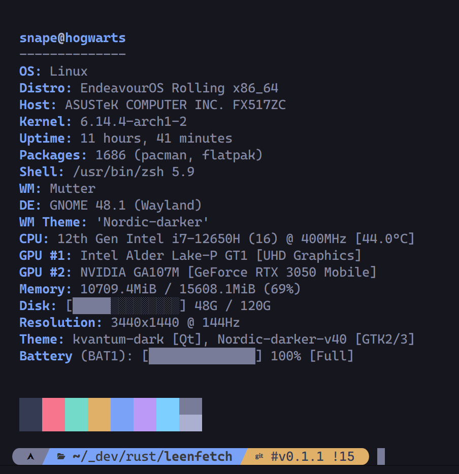
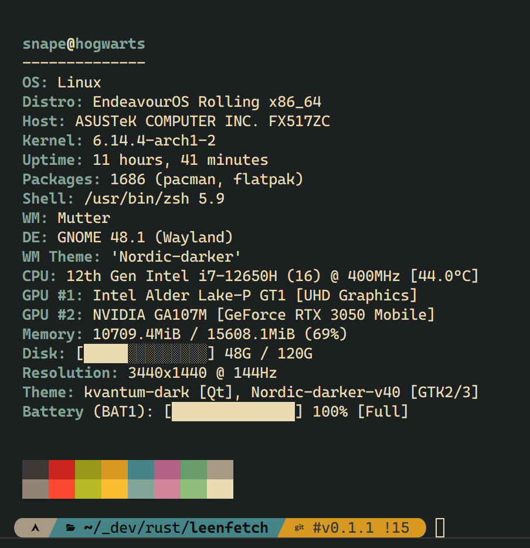
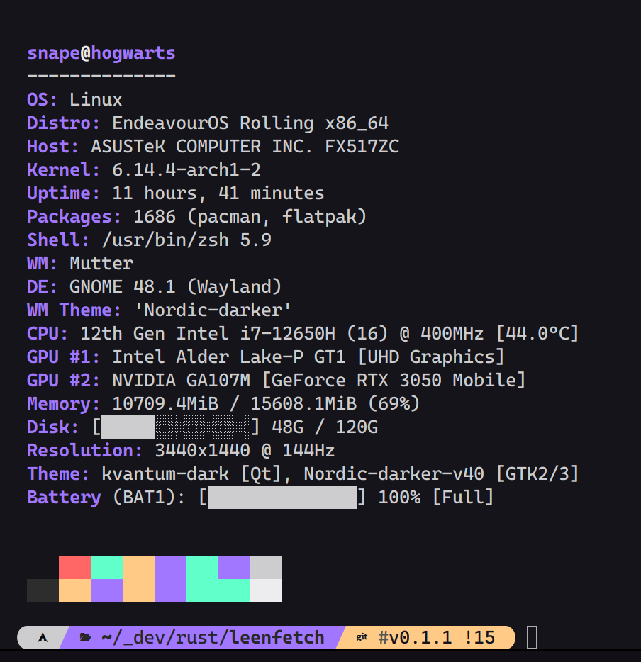
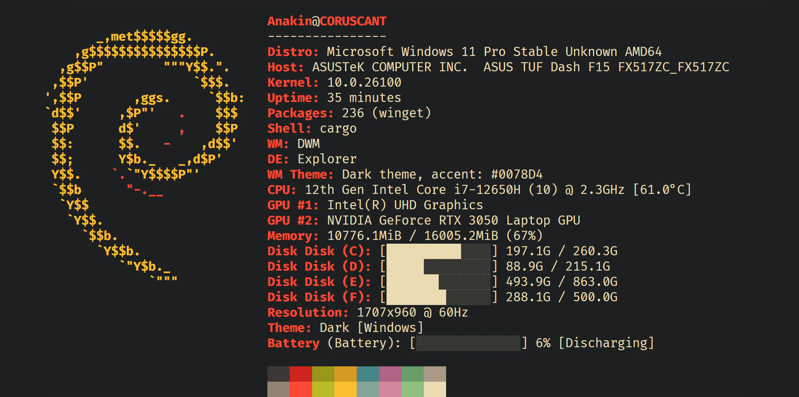
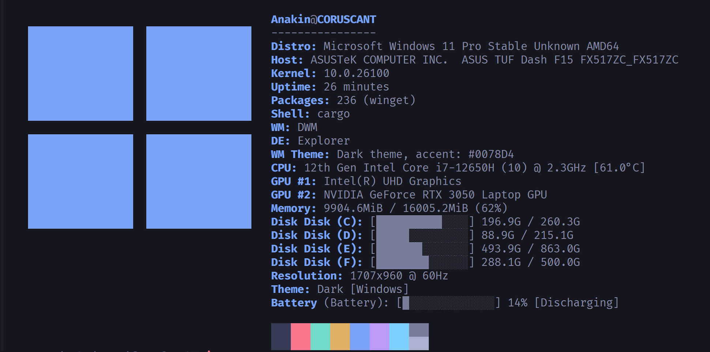
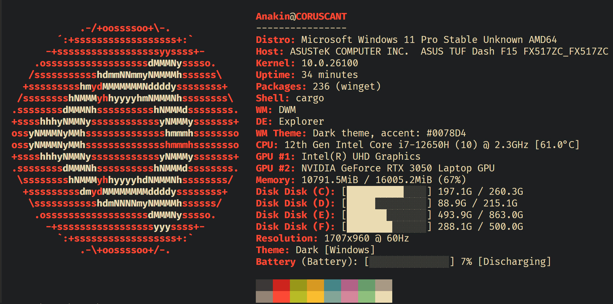
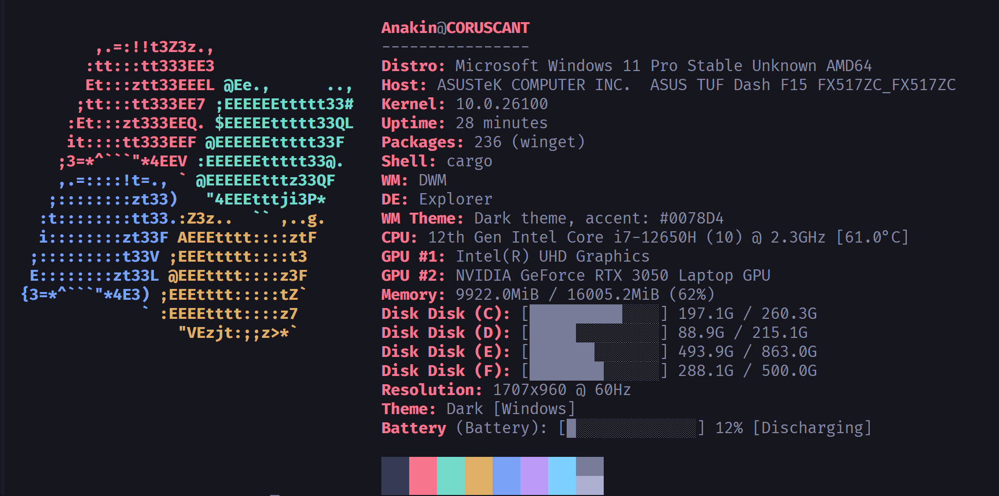

# 🧠 LeenFetch

[](https://crates.io/crates/leenfetch)
[](LICENSE)


> 🌐 Available in: [English](#) | [فارسی](./readme/README-fa.md) | [Русский](./readme/README-ru.md) | [中文](./readme/README-zh.md)


##### A fast, minimal, and customizable system information tool built in Rust — your alternative to Neofetch, for real power users.


> ⚠️ **LeenFetch is under active development. Expect bugs and improvements regularly!**
>
> Want to help? Contributions, testing, and feedback are always welcome!


## 💬 Feedback & Issues

Found a bug? Got a feature idea?  
Head over to the [issues](https://github.com/drunkleen/leenfetch/issues) or join the [discussions](https://github.com/drunkleen/leenfetch/discussions) page!

## 📚 Table of Contents

- [Screenshots](#-screenshots)
- [Features](#-features)
- [Installation](#-installation)
- [Configuration](#️-configuration)
- [Roadmap](#-roadmap)
- [Contributing](#-contributing)
- [Support LeenFetch](#-support-leenfetch)
- [License](#-license)
- [Inspiration](#-inspiration)


## 📸 Screenshots











## 🚀 Features

- ⚡ Blazing fast startup thanks to Rust
- 🎨 Customizable output layout with colorized terminal output
- 🧩 Modular design — enable or disable components via config
- 💾 Smart defaults but easily extendable
- 📦 Detects installed packages, shell, GPU, DE/WM, and more
- 🖼️ Custom ASCII art support and override via config
- 🎨 Supports theme-based color profiles (`ascii_colors=distro`, etc.)
- 🔌 Simple config file: `~/.config/leenfetch/config.conf`


## 📦 Installation

### ✅ Install from crates.io (recommended)

Make sure you have [Rust & Cargo](https://rustup.rs/) installed:

```bash
cargo install leenfetch
````

After that, just run:

```bash
leenfetch
```

If you hit issues with `PATH`, try adding `~/.cargo/bin` to your shell:

```bash
export PATH="$HOME/.cargo/bin:$PATH"
```

---

### 🛠️ Manual Installation (Build from Source)

```bash
git clone https://github.com/drunkleen/leenfetch.git
cd leenfetch
cargo build --release
```

Add to PATH:

```bash
cp target/release/leenfetch ~/.local/bin/
```

Then run:

```bash
leenfetch
```


---

## ⚙️ Configuration

On first run, LeenFetch will generate:

```bash
~/.config/leenfetch/config.conf
```

Edit it to enable/disable modules, change layout, or tweak shorthand formats.

### Example Options:

```ini
# Output toggles
show_os=on
show_kernel=on
show_gpu=on
show_packages=off

# Shorthands and formatting
distro_shorthand=tiny
cpu_temp=C
memory_unit=mib
```

The layout is fully customizable with `[tags]`, e.g.:

```ini
layout="
[titles]
{username}@{hostname}
[/titles]

[cpu]
CPU: {cpu_index}
[/cpu]
"
```

For a full list of options:

```bash
leenfetch --list-options
```

---

## 🎯 Roadmap

| Feature                     | Status        |
| --------------------------- | ------------- |
| Base module system          | ✅ Done       |
| Config file loader          | ✅ Done       |
| Custom layout tags          | ✅ Done       |
| GPU/CPU/Mem/DE/WM detection | ✅ Done       |
| Linux support               | ✅ Done       |
| Windows support             | ✅ Done       |
| CLI override options        | 🔁 Basic      |
| ASCII art & theming         | 🔁 Basic      |
| Multi-Threading             | 🔄 Planned    |
| macOS support               | 🔄 Planned    |
| OpenBSD support             | 🔄 Planned    |
| Plugin/module system        | ❓ Maybe      |
| Fetch info over SSH         | ❓ Maybe      |

---

## 🤝 Contributing

1. Fork the repo
2. Create your branch (`git checkout -b feature/my-feature`)
3. Commit your changes (`git commit -m 'feat: add my feature'`)
4. Push to the branch (`git push origin feature/my-feature`)
5. Create a Pull Request

We welcome clean PRs and documented modules! ✨

---

## ☕ Support LeenFetch

If you have found LeenFetch valuable and would like to contribute to its ongoing development, your support is greatly
appreciated. You can show your appreciation by making a donation
through [PayPal](https://www.paypal.com/paypalme/RDarvishifar) or any of the following cryptocurrency networks:

- **Bitcoin (BTC):** `bc1qsmvxpn79g6wkel3w67k37r9nvzm5jnggeltxl6`
- **ETH/BNB/MATIC (ERC20, BEP20):** `0x8613aD01910d17Bc922D95cf16Dc233B92cd32d6`
- **USDT/TRON (TRC20):** `TGNru3vuDfPh5zBJ31DKzcVVvFgfMK9J48`
- **Dogecoin (DOGE):** `D8U25FjxdxdQ7pEH37cMSw8HXBdY1qZ7n3`

Your generous contribution ensures the continued improvement and maintenance of LeenFetch. ❤️

Thank you for supporting the project! 🙏

---

## 📄 License

[MIT](./LICENSE) License © [DrunkLeen](https://github.com/drunkleen)

---

## 💡 Inspiration

* [Neofetch](https://github.com/dylanaraps/neofetch)
* [Fastfetch](https://github.com/fastfetch-cli/fastfetch)
* [Rust](https://www.rust-lang.org/) — the foundation of LeenFetch
