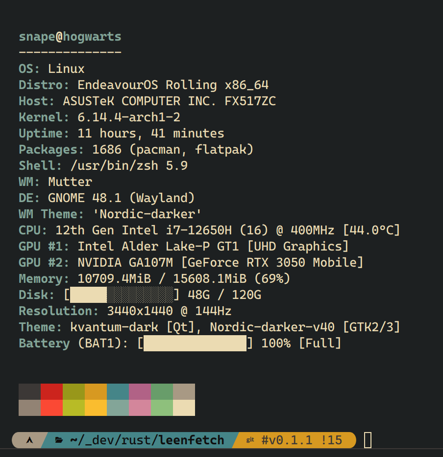

# 🧠 LeenFetch

<p align="center">
    <a href="../README.md">ENGLISH</a>
    | <a href="#">فارسی</a>
    | <a href="./README-ru.md">Русский </a>
    | <a href="./README-zh.md">中文</a>
</p>

### ابزار سریع، کم‌حجم، و قابل تنظیم نمایش اطلاعات سیستم با زبان Rust — جایگزینی واقعی برای Neofetch برای کاربران حرفه‌ای.

---

<div dir="rtl">



</div>

---

## 🚀 ویژگی‌ها

- ⚡ شروع سریع و بی‌درنگ به لطف زبان Rust
- 🎨 خروجی رنگی و قابل تنظیم با استفاده از تگ‌های قالب
- 🧩 طراحی ماژولار — فعال یا غیرفعال کردن ماژول‌ها با پیکربندی ساده
- 💾 تنظیمات پیش‌فرض هوشمند و در عین حال قابل گسترش
- 📦 شناسایی پکیج‌ها، شل، GPU، محیط دسکتاپ و مدیریت پنجره
- 🔌 فایل پیکربندی ساده در مسیر: `~/.config/leenfetch/config.conf`

---

## 📦 نصب

### ✅ نصب از crates.io (توصیه‌شده)

مطمئن شوید که [cargo](https://rustup.rs/) نصب دارید.

```bash
cargo install leenfetch
````

سپس فقط اجرا کنید:

```bash
leenfetch
```

اگر مشکلی در شناسایی دستور داشتید، مسیر زیر را به PATH اضافه کنید:

```bash
export PATH="$HOME/.cargo/bin:$PATH"
```

---

### 🛠️ نصب دستی (ساخت از سورس)

```bash
git clone https://github.com/drunkleen/leenfetch.git
cd leenfetch
cargo build --release
```

افزودن به مسیر:

```bash
cp target/release/leenfetch ~/.local/bin/
```

و سپس:

```bash
leenfetch
```

---

## ⚙️ تنظیمات

در اولین اجرا، فایل زیر ساخته می‌شود:

```bash
~/.config/leenfetch/config.conf
```

آن را ویرایش کنید تا ماژول‌ها را فعال/غیرفعال کرده و خروجی را سفارشی‌سازی نمایید.

### نمونه‌ای از تنظیمات:

```ini
# ماژول‌ها
show_os=on
show_kernel=on
show_gpu=on
show_packages=off

# فرمت‌ها و اختصارات
distro_shorthand=tiny
cpu_temp=C
memory_unit=mib
```

قالب خروجی با تگ‌های قابل تنظیم:

```ini
layout="
[titles]
{username}@{hostname}
[/titles]

[cpu]
CPU: {cpu_index}
[/cpu]
"
```

برای دیدن تمام گزینه‌های موجود:

```bash
leenfetch --list-options
```

---

## 🎯 نقشه راه (Roadmap)

| ویژگی                       | وضعیت           |
| --------------------------- | --------------- |
| ساختار پایه ماژول‌ها        | ✅ انجام شده     |
| بارگذاری فایل پیکربندی      | ✅ انجام شده     |
| قالب‌سازی با تگ‌های سفارشی  | ✅ انجام شده     |
| شناسایی GPU/CPU/MEM/DE/WM   | ✅ انجام شده     |
| پروفایل رنگ / تم‌بندی       | ✅ اولیه         |
| پشتیبانی از ASCII Art       | ✅ اولیه       |
| چند-نخی‌سازی (multi-thread) | 🔄 در برنامه    |
| پشتیبانی از Windows         | ✅ انجام شده    |
| پشتیبانی از macOS           | 🔄 در برنامه    |
| پشتیبانی از OpenBSD         | 🔄 در برنامه    |
| پشتیبانی از افزونه‌ها       | ❓ شاید          |
| دریافت اطلاعات از راه دور   | ❓ شاید          |

---

## 🤝 مشارکت

1. مخزن را فورک کنید
2. یک برنچ جدید بسازید: `git checkout -b feature/my-feature`
3. تغییرات خود را کامیت کنید: `git commit -m 'feat: اضافه کردن ویژگی من'`
4. پوش کنید: `git push origin feature/my-feature`
5. یک Pull Request باز کنید

از PRهای تمیز و ماژول‌های مستند استقبال می‌کنیم! ✨

---


## 💰 حمایت مالی

اگر **LeenFetch** برای شما مفید بوده و تمایل دارید در توسعه مداوم آن نقش داشته باشید، حمایت شما بسیار ارزشمند است.

می‌توانید از طریق [PayPal](https://www.paypal.com/paypalme/RDarvishifar) یا هر یک از شبکه‌های ارز دیجیتال زیر، از این پروژه پشتیبانی مالی کنید:


- **Bitcoin (BTC):** `bc1qsmvxpn79g6wkel3w67k37r9nvzm5jnggeltxl6`
- **ETH/BNB/MATIC (ERC20, BEP20):** `0x8613aD01910d17Bc922D95cf16Dc233B92cd32d6`
- **USDT/TRON (TRC20):** `TGNru3vuDfPh5zBJ31DKzcVVvFgfMK9J48`
- **Dogecoin (DOGE):** `D8U25FjxdxdQ7pEH37cMSw8HXBdY1qZ7n3`

حمایت مالی شما به بهبود، نگهداری و توسعه‌ی بیشتر پروژه کمک می‌کند ❤️

با سپاس از همراهی و پشتیبانی شما! 🙏

---

## 📄 لایسنس

پروژه تحت مجوز [MIT](./LICENSE) می‌باشد — ساخته‌شده توسط [DrunkLeen](https://github.com/drunkleen)

---

## 💡 الهام گرفته‌شده از:

* [Neofetch](https://github.com/dylanaraps/neofetch)
* [Fastfetch](https://github.com/fastfetch-cli/fastfetch)
* [Rust](https://www.rust-lang.org/) 
