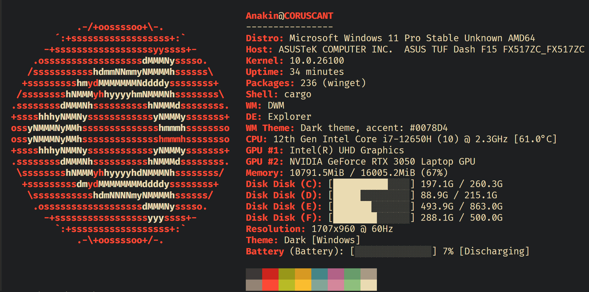

# 🧠 LeenFetch

[](https://crates.io/crates/leenfetch)
[](LICENSE)

<div dir="rtl">


> 🌐 زبان‌ها: [English](../README.md) | [فارسی](#) | [Русский](./README-ru.md) | [中文](./README-zh.md)

##### ابزاری سریع، مینیمال و قابل تنظیم برای نمایش اطلاعات سیستم، نوشته شده با زبان Rust — جایگزینی واقعی برای Neofetch مخصوص کاربران حرفه‌ای.

> ⚠️ **LeenFetch در حال توسعه فعال است. انتظار بروز باگ و بروزرسانی‌های منظم را داشته باشید!**
> می‌خواهید کمک کنید؟ مشارکت، تست و بازخورد شما همیشه خوش‌آمد است.

---

## 💬 بازخورد و گزارش باگ

باگ پیدا کردید؟ ایده‌ای برای ویژگی جدید دارید؟
به [بخش Issues](https://github.com/drunkleen/leenfetch/issues) یا [Discussions](https://github.com/drunkleen/leenfetch/discussions) مراجعه کنید!

---

## 📚 فهرست مطالب

* [تصاویر](#-تصاویر)
* [ویژگی‌ها](#-ویژگیها)
* [نصب](#-نصب)
* [پیکربندی](#️-پیکربندی)
* [نقشه راه](#-نقشه-راه)
* [مشارکت در توسعه](#-مشارکت-در-توسعه)
* [حمایت از LeenFetch](#-حمایت-از-leenfetch)
* [لایسنس](#-لایسنس)
* [الهام‌گیری](#-الهامگیری)

---

## 📸 تصاویر





---

## 🚀 ویژگی‌ها

* ⚡ راه‌اندازی بسیار سریع به لطف زبان Rust
* 🎨 خروجی رنگی و قابل سفارشی‌سازی
* 🧩 طراحی ماژولار — امکان فعال/غیرفعال‌سازی اجزا از طریق پیکربندی
* 💾 پیش‌فرض‌های هوشمند اما قابل گسترش
* 📦 شناسایی خودکار بسته‌های نصب‌شده، پوسته، کارت گرافیک، محیط دسکتاپ و مدیریت پنجره
* 🖼️ پشتیبانی از هنر ASCII سفارشی
* 🎨 پشتیبانی از پروفایل رنگی مبتنی بر توزیع یا قالب‌بندی (`ascii_colors=distro`)
* 🔌 فایل پیکربندی ساده: `~/.config/leenfetch/config.conf`

---

## 📦 نصب

### ✅ نصب از crates.io (پیشنهادی)

ابتدا مطمئن شوید [Rust و Cargo](https://rustup.rs/) را نصب کرده‌اید:

```bash
cargo install leenfetch
```

سپس اجرا کنید:

```bash
leenfetch
```

در صورت مواجهه با ارور مسیر (PATH)، خط زیر را به فایل bash/zsh خود اضافه کنید:

```bash
export PATH="$HOME/.cargo/bin:$PATH"
```

---

### 🛠️ نصب دستی (ساخت از سورس)

```bash
git clone https://github.com/drunkleen/leenfetch.git
cd leenfetch
cargo build --release
```

افزودن به PATH:

```bash
cp target/release/leenfetch ~/.local/bin/
```

و اجرای برنامه:

```bash
leenfetch
```

---

## ⚙️ پیکربندی

در اولین اجرا، فایل زیر به صورت خودکار ساخته می‌شود:

```bash
~/.config/leenfetch/config.conf
```

می‌توانید این فایل را برای فعال‌سازی یا غیرفعال‌سازی ماژول‌ها، تغییر چیدمان، یا تنظیمات دیگر ویرایش کنید.

### نمونه گزینه‌ها:

```ini
# فعال/غیرفعال کردن ماژول‌ها
show_os=on
show_kernel=on
show_gpu=on
show_packages=off

# میانبرها و فرمت‌بندی‌ها
distro_shorthand=tiny
cpu_temp=C
memory_unit=mib
```

چیدمان خروجی کاملاً قابل شخصی‌سازی است:

```ini
layout="
[titles]
{username}@{hostname}
[/titles]

[cpu]
CPU: {cpu_index}
[/cpu]
"
```

برای دیدن لیست کامل گزینه‌ها:

```bash
leenfetch --list-options
```

---

## 🎯 نقشه راه

| ویژگی                     | وضعیت          |
| ------------------------ | -------------- |
| سیستم ماژول پایه            | ✅ انجام شده     |
| بارگذاری فایل پیکربندی         | ✅ انجام شده     |
| پشتیبانی از تگ‌های چیدمان     | ✅ انجام شده     |
| شناسایی GPU/CPU/رم/DE/WM   | ✅ انجام شده     |
| پشتیبانی از لینوکس           | ✅ انجام شده     |
| پشتیبانی از ویندوز            | ✅ انجام شده     |
| تنظیمات CLI               | 🔁 پایه‌ای         |
| پشتیبانی از ASCII/تم        | 🔁 پایه‌ای          |
| پشتیبانی از چندریسمانی        | 🔄 در حال برنامه‌ریزی |
| پشتیبانی از macOS           | 🔄 در حال برنامه‌ریزی |
| پشتیبانی از OpenBSD         | 🔄 در حال برنامه‌ریزی |
| سیستم افزونه/ماژول          | ❓ شاید           |
| دریافت اطلاعات از طریق SSH   | ❓ شاید           |

---

## 🤝 مشارکت در توسعه

1. مخزن را Fork کنید
2. یک شاخه جدید بسازید (`git checkout -b feature/my-feature`)
3. تغییرات را Commit کنید (`git commit -m 'feat: اضافه کردن ویژگی من'`)
4. تغییرات را Push کنید (`git push origin feature/my-feature`)
5. یک Pull Request باز کنید!

ما از PRهای تمیز و ماژول‌های مستندسازی‌شده استقبال می‌کنیم! ✨

---

## ☕ حمایت از LeenFetch

اگر LeenFetch برای شما مفید بوده و می‌خواهید از توسعه آن حمایت کنید، لطفاً با یکی از روش‌های زیر ما را پشتیبانی کنید:

* [PayPal](https://www.paypal.com/paypalme/RDarvishifar)
* **Bitcoin (BTC):** `bc1qsmvxpn79g6wkel3w67k37r9nvzm5jnggeltxl6`
* **ETH/BNB/MATIC (ERC20/BEP20):** `0x8613aD01910d17Bc922D95cf16Dc233B92cd32d6`
* **USDT/TRON (TRC20):** `TGNru3vuDfPh5zBJ31DKzcVVvFgfMK9J48`
* **Dogecoin (DOGE):** `D8U25FjxdxdQ7pEH37cMSw8HXBdY1qZ7n3`

💖 سپاسگزاریم از حمایت شما برای ادامه توسعه این پروژه!

---

## 📄 لایسنس

[MIT](./LICENSE)
حق‌نشر © [DrunkLeen](https://github.com/drunkleen)

---

## 💡 الهام‌گیری

* [Neofetch](https://github.com/dylanaraps/neofetch)
* [Fastfetch](https://github.com/fastfetch-cli/fastfetch)
* [Rust](https://www.rust-lang.org/) — پایه توسعه LeenFetch


</div>