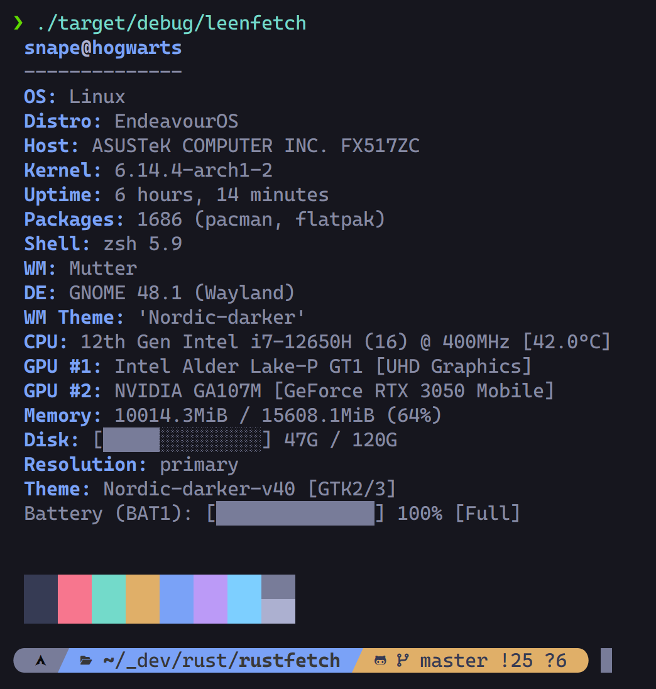
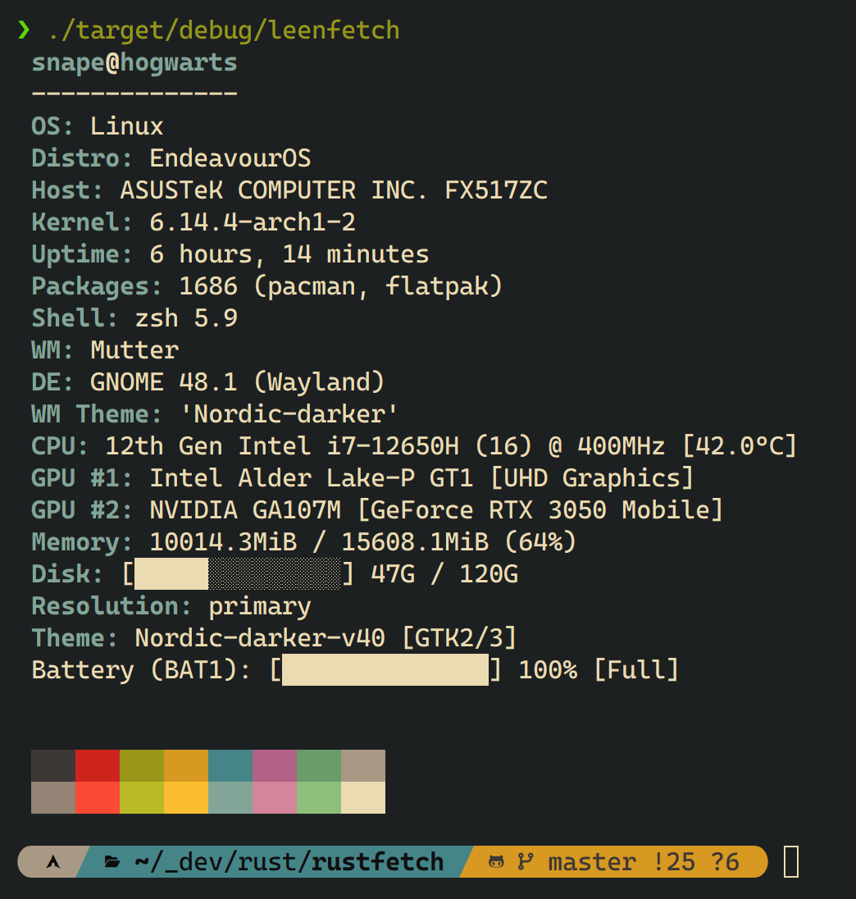
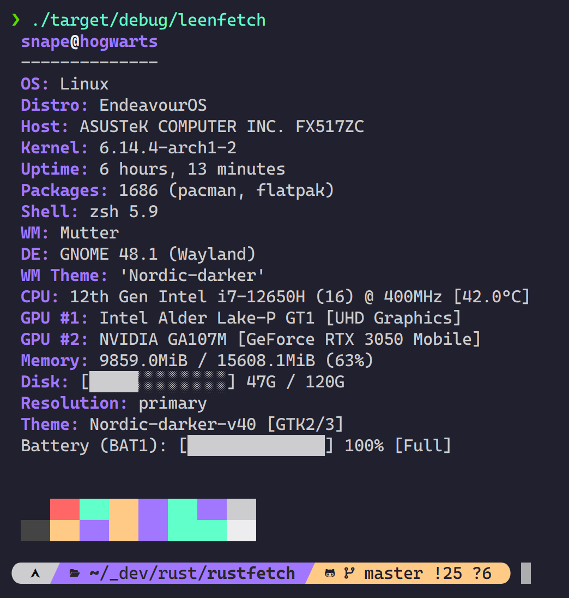

# 🧠 LeenFetch

<p align="center">
    <a href="../README.md">ENGLISH</a>
    | <a href="./README-fa.md">فارسی</a>
    | <a href="#">Русский </a>
    | <a href="./README-zh.md">中文</a>
</p>

### Быстрый, минималистичный и настраиваемый инструмент отображения системной информации на Rust — отличная альтернатива Neofetch для настоящих power-пользователей.

---





## 🚀 Возможности

- ⚡ Молниеносный запуск благодаря Rust
- 🎨 Настраиваемое оформление и цветной вывод в терминале
- 🧩 Модульная структура — включай и выключай модули через конфиг
- 💾 Умные значения по умолчанию, легко расширяемые
- 📦 Определение установленных пакетов, оболочки, GPU, DE/WM и прочего
- 🔌 Простой конфиг-файл: `~/.config/leenfetch/config.conf`
<!-- - 🖼️ Поддержка ASCII-графики и динамических тем (в будущем) -->

---

## 📦 Установка

### ✅ Установка через crates.io (рекомендуется)

Убедитесь, что у вас установлен [cargo](https://rustup.rs/):

```bash
cargo install leenfetch
````

Затем просто запустите:

```bash
leenfetch
```

Если возникли проблемы с `PATH`, добавьте `~/.cargo/bin` в переменную окружения:

```bash
export PATH="$HOME/.cargo/bin:$PATH"
```

---

### 🛠️ Ручная установка (сборка из исходников)

```bash
git clone https://github.com/drunkleen/leenfetch.git
cd leenfetch
cargo build --release
```

Добавьте в PATH:

```bash
cp target/release/leenfetch ~/.local/bin/
```

И запустите:

```bash
leenfetch
```

---

## ⚙️ Конфигурация

При первом запуске LeenFetch создаст файл:

```bash
~/.config/leenfetch/config.conf
```

Редактируйте его для включения/отключения модулей, изменения оформления и сокращений.

### Примеры настроек:

```ini
# Включение модулей
show_os=on
show_kernel=on
show_gpu=on
show_packages=off

# Форматирование и сокращения
distro_shorthand=tiny
cpu_temp=C
memory_unit=mib
```

Макет полностью настраивается с помощью `[[тегов]]`, например:

```ini
layout="
[[titles]]
{username}@{hostname}
[[/titles]]

[[cpu]]
CPU: {cpu_index}
[[/cpu]]
"
```

Список всех доступных опций:

```bash
leenfetch --list-options
```

---

## 🎯 Дорожная карта

| Возможность                   | Статус      |
| ----------------------------- | ----------- |
| Базовая система модулей       | ✅ Готово    |
| Загрузка конфигов             | ✅ Готово    |
| Кастомные теги в макете       | ✅ Готово    |
| Обнаружение GPU/CPU/MEM/DE/WM | ✅ Готово    |
| Темизация / цветовые схемы    | ✅ Базовая   |
| Поддержка ASCII-графики       | 🔄 В планах |
| Многопоточность               | 🔄 В планах |
| Поддержка Windows             | 🔄 В планах |
| Поддержка macOS               | 🔄 В планах |
| Поддержка OpenBSD             | 🔄 В планах |
| Плагины/модули                | ❓ Возможно  |
| Получение инфы по SSH         | ❓ Возможно  |

---

## 🤝 Вклад

1. Форкните репозиторий
2. Создайте ветку (`git checkout -b feature/my-feature`)
3. Сделайте коммит (`git commit -m 'feat: add my feature'`)
4. Запушьте ветку (`git push origin feature/my-feature`)
5. Создайте Pull Request

Мы приветствуем аккуратные PR и документированные модули! ✨

---

## 💰 Поддержка

Если вам понравился **LeenFetch** и вы хотите внести вклад в его развитие — это будет очень ценно!

Вы можете поддержать проект через [PayPal](https://www.paypal.com/paypalme/RDarvishifar) или отправив криптовалюту:

* **Bitcoin (BTC):** `bc1qsmvxpn79g6wkel3w67k37r9nvzm5jnggeltxl6`
* **ETH/BNB/MATIC (ERC20, BEP20):** `0x8613aD01910d17Bc922D95cf16Dc233B92cd32d6`
* **USDT/TRON (TRC20):** `TGNru3vuDfPh5zBJ31DKzcVVvFgfMK9J48`
* **Dogecoin (DOGE):** `D8U25FjxdxdQ7pEH37cMSw8HXBdY1qZ7n3`

Ваша поддержка помогает проекту развиваться и жить ❤️

Спасибо за вашу помощь! 🙏

---

## 📄 Лицензия

[MIT](./LICENSE) Лицензия © [DrunkLeen](https://github.com/drunkleen)

---

## 💡 Вдохновение

* [Neofetch](https://github.com/dylanaraps/neofetch)
* [Fastfetch](https://github.com/fastfetch-cli/fastfetch)
* [Rust](https://www.rust-lang.org/) — основа LeenFetch
