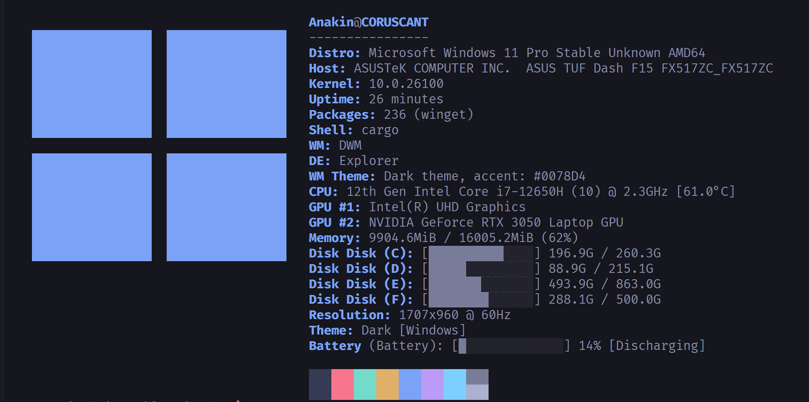

# 🧠 LeenFetch

[](https://crates.io/crates/leenfetch)
[](LICENSE)

> 🌐 语言版本: [英文](../README.md) | [فارسی](./README-fa.md) | [Русский](./README-ru.md) | [中文](#)

##### 一个用 Rust 编写的快速、极简且可定制的系统信息工具 —— 真正的 Neofetch 替代品，适用于高级用户。

> ⚠️ **LeenFetch 正在积极开发中，可能存在问题并不断改进！**
> 欢迎任何人参与贡献、测试和反馈！

---

## 💬 反馈与问题

发现 Bug？有新功能建议？
请访问 [Issues 页面](https://github.com/drunkleen/leenfetch/issues) 或加入 [Discussions 讨论区](https://github.com/drunkleen/leenfetch/discussions)！


---

## 📸 截图





---

## 🚀 功能特性

* ⚡ 超快速启动，得益于 Rust
* 🎨 支持带颜色的终端输出布局自定义
* 🧩 模块化设计 —— 可通过配置启用或禁用组件
* 💾 智能默认设置，易于扩展
* 📦 自动检测安装的软件包、Shell、GPU、桌面环境/窗口管理器等
* 🖼️ 支持自定义 ASCII 艺术并通过配置覆盖
* 🎨 支持基于主题的配色方案（如 `ascii_colors=distro`）
* 🔌 简单配置文件：`~/.config/leenfetch/config.conf`

---

## 📦 安装

### ✅ 推荐方式：通过 crates.io 安装

确保你已安装 [Rust 和 Cargo](https://rustup.rs/)：

```bash
cargo install leenfetch
```

安装完成后，运行：

```bash
leenfetch
```

如果出现 `PATH` 相关问题，请添加如下内容到你的 shell 配置：

```bash
export PATH="$HOME/.cargo/bin:$PATH"
```

---

### 🛠️ 手动安装（从源码构建）

```bash
git clone https://github.com/drunkleen/leenfetch.git
cd leenfetch
cargo build --release
```

添加至 PATH：

```bash
cp target/release/leenfetch ~/.local/bin/
```

然后运行：

```bash
leenfetch
```

---

## ⚙️ 配置

首次运行时，LeenFetch 会自动生成：

```bash
~/.config/leenfetch/config.conf
```

你可以编辑它来启用/禁用模块、自定义布局、设置格式等。

### 配置示例：

```ini
# 输出模块
show_os=on
show_kernel=on
show_gpu=on
show_packages=off

# 缩写与格式化
distro_shorthand=tiny
cpu_temp=C
memory_unit=mib
```

布局完全可自定义，例如：

```ini
layout="
[titles]
{username}@{hostname}
[/titles]

[cpu]
CPU: {cpu_index}
[/cpu]
"
```

获取完整配置项列表：

```bash
leenfetch --list-options
```

---

## 🎯 开发计划

| 功能                  | 状态      |
| ------------------- | ------- |
| 基础模块系统              | ✅ 已完成   |
| 配置文件加载器             | ✅ 已完成   |
| 自定义布局标签             | ✅ 已完成   |
| GPU/CPU/内存/DE/WM 检测 | ✅ 已完成   |
| Linux 支持            | ✅ 已完成   |
| Windows 支持          | ✅ 已完成   |
| CLI 参数覆盖            | 🔁 基础支持 |
| ASCII 艺术与主题系统       | 🔁 基础支持 |
| 多线程支持               | 🔄 计划中  |
| macOS 支持            | 🔄 计划中  |
| OpenBSD 支持          | 🔄 计划中  |
| 插件/模块化系统            | ❓ 可能支持  |
| 通过 SSH 获取信息         | ❓ 可能支持  |

---

## 🤝 参与贡献

1. Fork 本仓库
2. 创建新分支 (`git checkout -b feature/my-feature`)
3. 提交你的更改 (`git commit -m 'feat: 添加某个功能'`)
4. 推送到远程分支 (`git push origin feature/my-feature`)
5. 创建 Pull Request！

欢迎干净的 PR 和有文档说明的模块！✨

---

## ☕ 支持 LeenFetch

如果你觉得 LeenFetch 有价值并希望支持它的持续开发，非常感谢你的帮助！

你可以通过 [PayPal](https://www.paypal.com/paypalme/RDarvishifar) 或以下加密货币方式捐赠：

* **Bitcoin (BTC)：** `bc1qsmvxpn79g6wkel3w67k37r9nvzm5jnggeltxl6`
* **ETH/BNB/MATIC (ERC20/BEP20)：** `0x8613aD01910d17Bc922D95cf16Dc233B92cd32d6`
* **USDT/TRON (TRC20)：** `TGNru3vuDfPh5zBJ31DKzcVVvFgfMK9J48`
* **Dogecoin (DOGE)：** `D8U25FjxdxdQ7pEH37cMSw8HXBdY1qZ7n3`

感谢你的慷慨支持，让 LeenFetch 得以不断改进和维护 ❤️

---

## 📄 许可证

[MIT](./LICENSE) 协议
版权所有 © [DrunkLeen](https://github.com/drunkleen)

---

## 💡 灵感来源

* [Neofetch](https://github.com/dylanaraps/neofetch)
* [Fastfetch](https://github.com/fastfetch-cli/fastfetch)
* [Rust](https://www.rust-lang.org/) — LeenFetch 的开发语言
